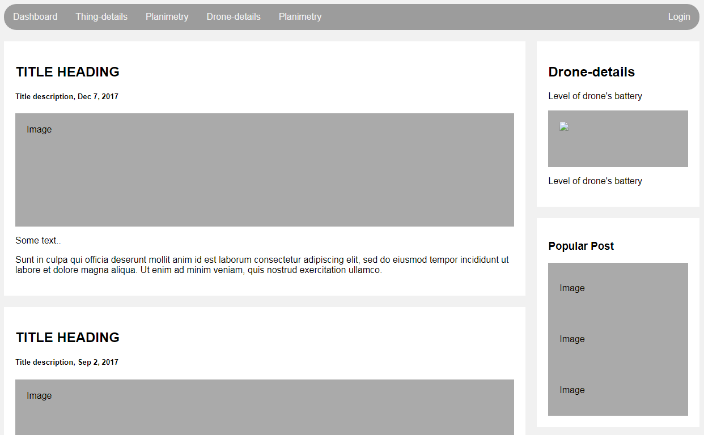

# dashboard
The navigation bar contains all the addresses to the other pages of the project.
In the center left there are the last states of the drone, where the top is the title of the operation under an image of the operation done and under a small description of the operation.
At the top right the drone battery level.
Below this are other drone statistics.

